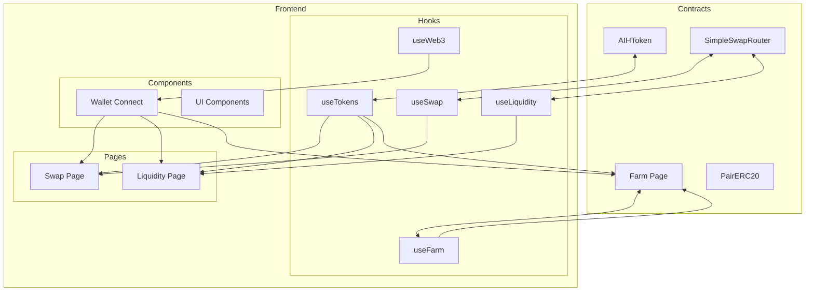
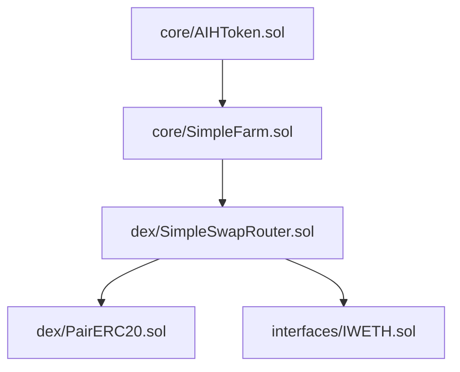
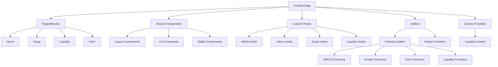

# AIHarvest 2.0

A decentralized finance (DeFi) platform for token swapping, liquidity provision, and yield farming built on the Ethereum ecosystem.

去中心化金融(DeFi)平台，基于以太坊生态系统构建，用于代币交换、流动性提供和收益耕作。

## Overview 概述

AIHarvest 2.0 is a complete DeFi solution with:
- Solidity smart contracts for on-chain operations
- Next.js frontend for user interaction
- Token swapping with automated market maker
- Liquidity provision with fee collection
- Yield farming with staking rewards

AIHarvest 2.0是一个完整的DeFi解决方案，包括：
- 用于链上操作的Solidity智能合约
- 用于用户交互的Next.js前端
- 具有自动做市商的代币交换
- 具有费用收集的流动性提供
- 具有质押奖励的收益耕作

## Project Structure 项目结构

```
aiharvest/
├── contracts/               # Smart contract code 智能合约代码
│   ├── contracts/           # Solidity contracts 合约源码
│   │   ├── core/            # Core protocol contracts 核心协议合约
│   │   │   ├── AIHToken.sol # Platform token 平台代币
│   │   │   └── SimpleFarm.sol # Yield farming contract 收益耕作合约
│   │   ├── dex/             # DEX related contracts DEX相关合约
│   │   │   ├── PairERC20.sol # LP token for liquidity pairs LP代币
│   │   │   └── SimpleSwapRouter.sol # DEX router with factory functionality DEX路由器
│   │   ├── interfaces/      # Contract interfaces 合约接口
│   │   └── test/            # Testing contracts 测试合约
│   ├── scripts/             # Deployment and utility scripts 部署和工具脚本
│   │   ├── deploy.js        # Local deployment script 本地部署脚本
│   │   ├── deploy-sepolia.js # Sepolia testnet deployment 测试网部署
│   │   ├── save-deployment.js # Save deployment artifacts 保存部署文件
│   │   ├── check-compilation.js # Verify contract compilation 验证合约编译
│   │   ├── run-reentrancy-check.js # Check for reentrancy vulnerabilities 检查重入漏洞
│   │   └── run-integration-tests.js # Run integration tests 运行集成测试
│   ├── test/                # Test files 测试文件
│   │   ├── CoreContracts.test.js # Tests for core contracts 核心合约测试
│   │   ├── reentrancy-test-v6.js # Reentrancy vulnerability tests 重入漏洞测试
│   │   ├── attack-vector-test.js # Security attack vector tests 安全攻击向量测试
│   │   ├── IntegrationTest.js # Complete system integration tests 完整系统集成测试
│   │   ├── test-full-system.js # Full system functionality tests 完整系统功能测试
│   │   └── extended-test-full-system.js # Extended system tests 扩展系统测试
│   └── deployments/         # Deployment artifacts 部署文件
│
├── frontend/                # Frontend application 前端应用
│   ├── components/          # Shared UI components 共享UI组件
│   │   ├── layout/          # Layout components 布局组件
│   │   └── wallet/          # Wallet connection components 钱包连接组件
│   ├── hooks/               # Custom React hooks 自定义React钩子
│   ├── pages/               # Next.js pages/routes Next.js页面/路由
│   ├── contexts/            # React contexts React上下文
│   ├── utils/               # Utility functions 工具函数
│   │   └── contracts/       # Contract utilities 合约工具
│   ├── styles/              # CSS styles CSS样式
│   ├── constants/           # Constants and configurations 常量和配置
│   └── scripts/             # Frontend scripts 前端脚本
│
├── backend/                 # Backend service 后端服务
│   ├── api/                 # API routes API路由
│   └── Dockerfile           # Docker configuration Docker配置
│
├── subgraph/                # The Graph indexing TheGraph索引
├── scripts/                 # Project-level scripts 项目级脚本
├── docs/                    # Documentation 文档
├── nginx/                   # Nginx configuration Nginx配置
└── docker-compose.yml       # Docker Compose configuration Docker Compose配置
```

## Key Features 主要功能

- **Token System**: ERC20 token with minting and vesting capabilities
  **代币系统**: 具有铸造和归属功能的ERC20代币

- **Decentralized Exchange**: Automated market maker for token swapping
  **去中心化交易所**: 用于代币交换的自动做市商

- **Liquidity Provision**: Add and remove liquidity to token pairs with fee earning
  **流动性提供**: 为代币对添加和移除流动性并赚取费用

- **Yield Farming**: Stake LP tokens to earn additional AIH token rewards
  **收益耕作**: 质押LP代币以赚取额外的AIH代币奖励

- **Wallet Integration**: Connect to MetaMask and other Web3 wallets
  **钱包集成**: 连接到MetaMask和其他Web3钱包

- **Responsive Design**: Works on desktop and mobile devices
  **响应式设计**: 适用于桌面和移动设备

## Technology Stack 技术栈

### Smart Contracts 智能合约
- Solidity (^0.8.20)
- Hardhat
- OpenZeppelin Contracts
- ethers.js

### Frontend 前端
- Next.js (React)
- TypeScript
- Tailwind CSS
- ethers.js
- wagmi
- React Context API

## Architecture 架构

### System Architecture 系统架构



### Contract Architecture 合约架构



### Frontend Architecture 前端架构



## Setup and Installation 设置和安装

### Prerequisites 前提条件

- Node.js (v16+)
- npm or yarn
- MetaMask or another Ethereum wallet

### Contract Development 合约开发

```bash
# Navigate to contracts directory 导航到合约目录
cd contracts

# Install dependencies 安装依赖
npm install

# Compile contracts 编译合约
npm run compile

# Run tests 运行测试
npm run test

# Deploy to local network 部署到本地网络
npm run deploy

# Deploy to Sepolia testnet 部署到Sepolia测试网
npm run deploy:sepolia
```

### Frontend Development 前端开发

```bash
# Navigate to frontend directory 导航到前端目录
cd frontend

# Install dependencies 安装依赖
npm install

# Start the development server 启动开发服务器
npm run dev

# Build for production 生产环境构建
npm run build

# Start production server 启动生产服务器
npm run start
```

### Environment Configuration 环境配置

#### Contracts (.env)

```
PRIVATE_KEY=your_private_key
INFURA_PROJECT_ID=your_infura_id
ETHERSCAN_API_KEY=your_etherscan_key
```

#### Frontend (.env.local)

```
NEXT_PUBLIC_CHAIN_ID=11155111  # Sepolia testnet
NEXT_PUBLIC_RPC_URL=https://sepolia.infura.io/v3/your-infura-id
```

## Development Guidelines 开发指南

### Smart Contract Development 智能合约开发

1. **Security First**: Always prioritize security in contract development
   **安全第一**: 在合约开发中始终优先考虑安全性

2. **Test Coverage**: Maintain comprehensive test coverage for all contracts
   **测试覆盖**: 为所有合约维护全面的测试覆盖

3. **Gas Optimization**: Optimize contracts for gas efficiency
   **Gas优化**: 优化合约以提高gas效率

4. **Documentation**: Keep natspec documentation up-to-date
   **文档**: 保持natspec文档的更新

### Frontend Development 前端开发

1. **Component-first approach**: Design components before implementing pages
   **组件优先方法**: 在实现页面之前设计组件

2. **Single responsibility**: Each file should do one thing well
   **单一职责**: 每个文件应该只做好一件事

3. **Feature folders**: Organize new code by feature, not by type
   **功能文件夹**: 按功能而非类型组织新代码

4. **State separation**: Use contexts for shared state, local state for UI
   **状态分离**: 使用上下文管理共享状态，局部状态管理UI

5. **File size limits**: Keep files under 300 lines; extract components and logic when they grow
   **文件大小限制**: 文件保持在300行以内；当它们增长时提取组件和逻辑

### Recommended Structure for New Features 新功能的推荐结构

```
frontend/features/           # Feature-based organization 基于功能的组织
├── swap/                    # Swap feature
│   ├── components/          # Swap-specific components
│   ├── hooks/               # Swap-specific hooks
│   ├── utils/               # Swap-specific utilities
│   └── SwapContext.tsx      # Swap state management
├── liquidity/               # Liquidity feature
│   ├── components/          # Liquidity-specific components
│   ├── hooks/               # Liquidity-specific hooks
│   ├── utils/               # Liquidity-specific utilities
│   └── LiquidityContext.tsx # Liquidity state management
└── farm/                    # Farming feature
    ├── components/          # Farm-specific components
    ├── hooks/               # Farm-specific hooks
    ├── utils/               # Farm-specific utilities
    └── FarmContext.tsx      # Farm state management
```

## Core Smart Contracts 核心智能合约

### AIHToken.sol
- ERC20 token for the AIHarvest platform
- Features minting and burning capabilities
- Implements vesting for team and ecosystem allocations
- Total supply capped at 1 billion tokens

### SimpleFarm.sol
- Yield farming contract for staking LP tokens
- Distributes AIH token rewards to liquidity providers
- Allows depositing, withdrawing, and harvesting rewards
- Supports multiple pools with configurable reward allocation

### SimpleSwapRouter.sol
- DEX implementation for token swapping and liquidity management
- Integrated factory functionality for creating token pairs
- Provides methods for adding/removing liquidity, swapping tokens
- Implements 0.3% swap fee with configurable protocol fee

### PairERC20.sol
- LP (Liquidity Provider) token representation
- Minted when users provide liquidity to pools
- Burned when users withdraw liquidity
- Each pair has its own LP token

## Scripts and Test Files 脚本和测试文件

### Scripts 脚本

- **deploy.js**: Handles local network deployment with contract deployment sequence and initialization
  **deploy.js**: 处理本地网络部署，包括合约部署顺序和初始化

- **deploy-sepolia.js**: Specialized deployment script for Sepolia testnet with network-specific configurations
  **deploy-sepolia.js**: 用于Sepolia测试网的专用部署脚本，具有网络特定配置

- **save-deployment.js**: Saves deployment artifacts including contract addresses and ABIs for frontend consumption
  **save-deployment.js**: 保存部署文件，包括合约地址和ABI供前端使用

- **check-compilation.js**: Verifies contract compilation and identifies potential issues before deployment
  **check-compilation.js**: 验证合约编译并在部署前识别潜在问题

- **run-reentrancy-check.js**: Executes specialized tests to check for reentrancy vulnerabilities
  **run-reentrancy-check.js**: 执行专门的测试以检查重入漏洞

- **run-integration-tests.js**: Runs comprehensive integration tests to ensure system components work together
  **run-integration-tests.js**: 运行全面的集成测试，确保系统组件协同工作

### Test Files 测试文件

- **CoreContracts.test.js**: Unit tests for core contracts like AIHToken and SimpleFarm
  **CoreContracts.test.js**: 核心合约如AIHToken和SimpleFarm的单元测试

- **reentrancy-test-v6.js**: Specialized tests for identifying reentrancy vulnerabilities in contracts
  **reentrancy-test-v6.js**: 用于识别合约中重入漏洞的专门测试

- **attack-vector-test.js**: Tests various security attack vectors against the contracts
  **attack-vector-test.js**: 测试针对合约的各种安全攻击向量

- **IntegrationTest.js**: Comprehensive integration tests for the entire system
  **IntegrationTest.js**: 整个系统的全面集成测试

- **test-full-system.js**: Tests the full functionality of the system in a simulated environment
  **test-full-system.js**: 在模拟环境中测试系统的完整功能

- **extended-test-full-system.js**: Extended tests with edge cases and advanced scenarios
  **extended-test-full-system.js**: 带有边缘情况和高级场景的扩展测试

## Frontend Features 前端功能

### Swap Page 交换页面
- Token selection interface
- Price information display
- Slippage tolerance settings
- Transaction confirmation

### Liquidity Page 流动性页面
- Add and remove liquidity interface
- Liquidity position management
- Pool share and rewards tracking
- LP token management

### Farm Page 农场页面
- Stake LP tokens in various pools
- View and harvest rewards
- Track APR and pool allocations
- Manage farming positions

## Contract Integration 合约集成

The frontend integrates with smart contracts through custom React hooks that utilize ethers.js. Key integration points:

前端通过使用ethers.js的自定义React钩子与智能合约集成。主要集成点：

- **Token Contracts**: ERC20 tokens for balance and allowance management
  **代币合约**: 用于余额和授权管理的ERC20代币

- **Router**: For token swaps and path finding
  **路由器**: 用于代币交换和路径查找

- **Factory**: For creating and finding liquidity pairs
  **工厂**: 用于创建和查找流动性对

- **Farm**: For staking and yield farming operations
  **农场**: 用于质押和收益耕作操作

## Testing 测试

### Smart Contract Testing 智能合约测试

```bash
# Run all tests 运行所有测试
npm run test

# Run specific test 运行特定测试
npx hardhat test test/CoreContracts.test.js

# Check test coverage 检查测试覆盖率
npx hardhat coverage
```

### Frontend Testing 前端测试

Currently, the frontend does not have automated tests. This is an area for future improvement.

目前，前端没有自动化测试。这是未来需要改进的领域。

## Contributing 贡献

1. Create a feature branch from `develop`
   从`develop`创建功能分支

2. Make your changes following the development guidelines
   按照开发指南进行更改

3. Test your changes locally
   在本地测试您的更改

4. Submit a pull request to the `develop` branch
   向`develop`分支提交拉取请求

### Code Structure Best Practices 代码结构最佳实践

For frontend development:

1. **Component-first approach** - Design components before implementing pages
   **组件优先方法** - 在实现页面之前设计组件

2. **Single responsibility** - Each file should do one thing well
   **单一职责** - 每个文件应该只做好一件事

3. **Feature folders** - Organize new code by feature, not by type
   **功能文件夹** - 按功能而非类型组织新代码

4. **State separation** - Use contexts for shared state, local state for UI
   **状态分离** - 使用上下文管理共享状态，局部状态管理UI

5. **File size limits** - Keep files under 300 lines; extract components and logic when they grow
   **文件大小限制** - 文件保持在300行以内；当它们增长时提取组件和逻辑

For smart contract development:

1. **Security First** - Always prioritize security in contract development
   **安全第一** - 在合约开发中始终优先考虑安全性

2. **Test Coverage** - Maintain comprehensive test coverage for all contracts
   **测试覆盖** - 为所有合约维护全面的测试覆盖

3. **Gas Optimization** - Optimize contracts for gas efficiency
   **Gas优化** - 优化合约以提高gas效率

4. **Documentation** - Keep natspec documentation up-to-date
   **文档** - 保持natspec文档的更新

## License 许可

This project is licensed under the MIT License.

本项目采用MIT许可证。 