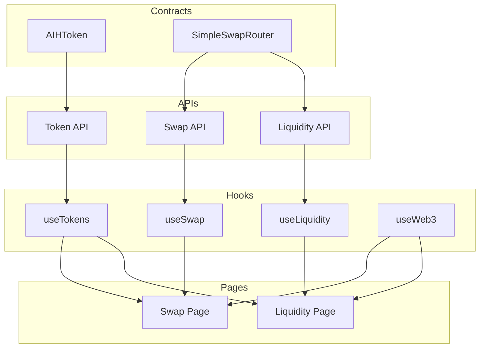

# AIHarvest 2.0

A decentralized platform for token swapping, liquidity provision, and yield farming.

## Implementation Status

### Smart Contracts
- ✅ AIHToken - ERC20 token implementation
- ✅ SimpleSwapRouter - DEX router for swapping tokens and managing liquidity pools
- ❌ SimpleFarm - Farming contract has been removed

### Frontend Integration
- ✅ Contract ABIs defined and structured
- ✅ Contract interaction hooks implemented
  - useAIHToken - Interact with the AIH token contract
  - useSimpleSwap - Interact with the swap router
  - ❌ useSimpleFarm - Removed
- ✅ Swap interface connected to contracts
- ✅ Liquidity interface connected to contracts
  - Add/remove liquidity functionality
  - Liquidity position management
  - Pair address verification
- ❌ Farm interface removed

## Contract Integration

The frontend integrates with smart contracts through custom React hooks that utilize wagmi/ethers.js. This approach allows for:

1. **Abstracted Contract Interactions**: Components don't need to know the details of contract calls
2. **Network Awareness**: Automatically uses the correct contract address based on the connected network
3. **State Management**: Tracks loading, error, and success states for improved UX

### Example Usage

```tsx
// In a component
const { balance, approve, transfer } = useAIHToken();
const { swap, addLiquidity, removeLiquidity } = useSimpleSwap();
// Farm functionality has been removed
```

## Development

### Prerequisites
- Node.js 18+
- Hardhat for contract development
- Metamask or another web3 wallet

### Setup

1. Clone the repository
2. Install dependencies:
   ```
   npm install
   ```
3. Start the development server:
   ```
   npm run dev
   ```

### Architecture

The project follows a layered architecture:
- Smart contracts (On-chain)
- Data indexing (TheGraph)
- Backend services (Express.js)
- Frontend application (Next.js)

## Core Smart Contracts

We have implemented the following core smart contracts:

1. **AIHToken**: ERC20 token with minting, burning, and vesting capabilities
   - Community allocation for token distribution
   - Team tokens with vesting
   - Ecosystem fund with vesting

2. **SimpleSwapRouter**: DEX router for token swapping and liquidity provision
   - Create token pairs with deterministic addresses
   - Add and remove liquidity with optimal amount calculation
   - Swap tokens with fee mechanism (0.3% default fee)
   - AMM based on constant product formula (x*y=k)
   - Protocol fee collection (1/6 of fees)

// SimpleFarm contract has been removed from the frontend

## Pair Creation Mechanism

The SimpleSwapRouter implements a deterministic pair creation system:

1. Pair addresses are computed using a hash formula: `keccak256(ff + router_address + keccak256(token0 + token1) + init_code_hash)`
2. Token addresses are sorted to ensure consistent pairs (smaller address becomes token0)
3. Pairs are registered in a bidirectional mapping for efficient lookup
4. Initial liquidity requires a minimum threshold to prevent dust positions

## Liquidity Management

The platform provides a complete liquidity management system:

1. **Adding Liquidity**:
   - Select token pairs
   - Approve token spending
   - Receive LP tokens representing pool share
   - First liquidity provider sets the initial price ratio

2. **Managing Positions**:
   - View all liquidity positions in a user-friendly interface
   - See detailed information including token amounts and pool share
   - Verify pair addresses for additional security

3. **Removing Liquidity**:
   - Remove part or all of a position
   - Configurable slippage tolerance
   - Receive underlying tokens back proportional to pool share

## Next Steps

- Complete contract integration for farming interface
- Implement user positions tracking
- Add transaction history
- Develop analytics dashboard

## Project Structure

```
aiharvest/
├── contracts/               # Smart contract code
│   ├── AIHToken.sol         # Token contract
│   ├── SimpleFarm.sol       # Staking/farming contract
│   ├── SimpleSwapRouter.sol # Swap router contract
│   └── interfaces/          # Interface definitions
│
├── frontend/                # Frontend application
│   ├── components/          # Reusable components
│   ├── hooks/               # Custom hooks
│   ├── pages/               # Page components
│   │   ├── swap.tsx         # Token swap interface
│   │   ├── liquidity.tsx    # Liquidity management interface
│   │   └── farm.tsx         # Farming interface
│   ├── utils/               # Utility functions
│   │   └── contracts.ts     # Contract interaction functions
│   ├── public/              # Static assets
│   ├── styles/              # Style files
│   └── diagrams/            # Flow diagrams
│
├── backend/                 # Backend service
│   ├── api/                 # API routes
│   ├── config/              # Configuration files
│   ├── models/              # Data models
│   ├── services/            # Business logic
│   └── utils/               # Utility functions
│
├── subgraph/                # The Graph indexing
│   ├── schema.graphql       # GraphQL schema
│   ├── subgraph.yaml        # Subgraph configuration
│   └── mappings/            # Event mappings
│
├── scripts/                 # Deployment & management scripts
├── deployments/             # Deployment artifacts
├── nginx/                   # Nginx configuration
└── test/                    # Test code
```

## Getting Started

### Prerequisites

- Node.js 18+
- npm or yarn
- MongoDB
- Redis
- Hardhat
- Docker & Docker Compose (for local development with containers)

### Installation

1. Clone the repository
   ```
   git clone https://github.com/yourusername/aiharvest.git
   cd aiharvest
   ```

2. Set up the development environment
   ```
   # On Linux/Mac
   chmod +x scripts/setup-dev.sh
   ./scripts/setup-dev.sh
   
   # On Windows
   scripts\setup-dev.bat
   ```

3. Start development servers
   ```
   # Start backend services with Docker Compose
   docker-compose up -d
   
   # Start frontend development server
   npm run dev:frontend
   
   # Start backend development server
   npm run dev:backend
   
   # Start Hardhat local node
   npx hardhat node
   ```

## Process Flows

The project includes detailed flow diagrams for key processes:

1. **Liquidity Provision Flow**: Visualizes the complete process of adding liquidity
2. **Pair Creation Mechanism**: Illustrates how pair addresses are deterministically generated
3. **Token Swap Flow**: Shows the path of token exchange through the router

These diagrams help developers understand the system architecture and aid in further development.

## Features

1. **Connect Wallet**: Connect your Ethereum wallet to the platform
2. **Swap Tokens**: Exchange tokens with minimal slippage
3. **Add Liquidity**: Provide liquidity to earn trading fees
4. **Manage Positions**: View and manage your liquidity positions
5. **Stake LP Tokens**: Stake your LP tokens to earn AIH rewards
6. **Harvest Rewards**: Claim your earned AIH tokens
7. **Withdraw Stake**: Unstake your LP tokens
8. **Verify Positions**: Verify the authenticity of your liquidity positions

## License

MIT 



After removing farm functionality, the application now focuses solely on token swapping and liquidity provision. 