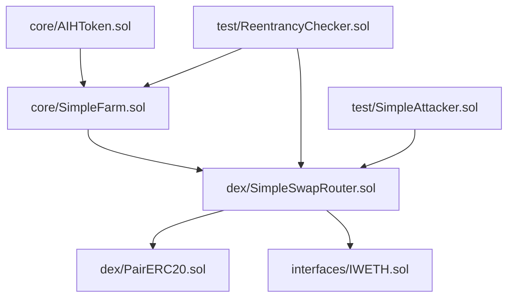

# AIHarvest Smart Contracts

## Overview 概述

AIHarvest is a DeFi platform that features a token, DEX, and yield farming system. The platform is built on the Ethereum ecosystem and uses Solidity smart contracts.

## Directory Structure 目录结构

The project now follows a more organized structure:

```
contracts/
├── core/                 # Core protocol contracts
│   ├── AIHToken.sol      # Platform token
│   └── SimpleFarm.sol    # Yield farming contract
├── dex/                  # DEX related contracts
│   ├── PairERC20.sol     # LP token for liquidity pairs
│   └── SimpleSwapRouter.sol # DEX router with factory functionality
├── interfaces/           # Contract interfaces
│   └── IWETH.sol         # Wrapped ETH interface
├── libraries/            # Shared utility libraries
├── scripts/              # Deployment and utility scripts
│   ├── deploy.js         # Main deployment script
│   ├── deploy-sepolia.js # Sepolia testnet deployment
│   ├── save-deployment.js # Save deployment addresses
│   ├── check-compilation.js # Verify contract compilation
│   ├── run-reentrancy-check.js # Reentrancy vulnerability test
│   └── run-integration-tests.js # Run all integration tests
├── test/                 # Test directory
│   ├── CoreContracts.test.js    # Core contract tests
│   ├── reentrancy-test-v6.js    # Reentrancy protection tests
│   ├── attack-vector-test.js    # Security vulnerability tests
│   ├── test-full-system.js      # End-to-end system tests
│   ├── extended-test-full-system.js # Extended system tests
│   ├── IntegrationTest.js       # Integration tests
└── test/                 # Testing contracts
    ├── ReentrancyChecker.sol # Security testing
    └── SimpleAttacker.sol    # Attack simulation
```

## Contract Architecture 合约架构



## Core Contracts 核心合约

### AIHToken.sol
- ERC20 token for the AIHarvest platform
- Features minting and burning capabilities
- Implements vesting for team and ecosystem allocations
- Total supply capped at 1 billion tokens

### SimpleFarm.sol
- Yield farming contract for staking LP tokens
- Distributes AIH token rewards to liquidity providers
- Allows depositing, withdrawing, and harvesting rewards
- Supports multiple pools with configurable reward allocation

## DEX Contracts DEX合约

### SimpleSwapRouter.sol
- DEX implementation for token swapping and liquidity management
- Integrated factory functionality for creating token pairs
- Provides methods for adding/removing liquidity, swapping tokens
- Implements 0.3% swap fee with configurable protocol fee
- Integrates with SimpleFarm for farming functionality

### PairERC20.sol
- LP (Liquidity Provider) token representation
- Minted when users provide liquidity to pools
- Burned when users withdraw liquidity
- Each pair has its own LP token

## Utility Contracts 工具合约

### ReentrancyChecker.sol
- Security testing contract to verify protection against reentrancy attacks
- Tests various functions in SimpleSwapRouter and SimpleFarm
- Uses MaliciousToken to simulate attack scenarios

### SimpleAttacker.sol
- Security testing contract for executing attack scenarios
- Tests reentrancy protection in SimpleSwapRouter
- Helps ensure platform security

## Scripts 脚本

The scripts directory contains deployment and utility scripts for the project:

### deploy.js
- Main deployment script for AIHarvest contracts
- Deploys AIHToken, SimpleSwapRouter, SimpleFarm
- Sets up initial configuration between contracts
- Used for local and mainnet deployments

### deploy-sepolia.js
- Deploys contracts to Sepolia testnet
- Similar to deploy.js but with testnet-specific configuration
- Includes additional verification steps for testnet

### save-deployment.js
- Saves contract addresses after deployment
- Creates deployment JSON records for frontend consumption
- Useful for tracking different network deployments

### check-compilation.js
- Verifies that all contracts compile without errors
- Runs before deployment to ensure code quality
- Validates contract dependencies

### run-reentrancy-check.js
- Executes reentrancy vulnerability tests
- Ensures contracts are protected against reentrancy attacks
- Part of the security testing suite

### run-integration-tests.js
- Runs all integration tests for the protocol
- Verifies that contracts work together as expected
- End-to-end testing of core functionality

## Tests 测试

The test directory contains comprehensive test suites for all aspects of the protocol:

### CoreContracts.test.js
- Basic tests for core contracts
- Verifies AIHToken, SimpleFarm functionality
- Tests basic token operations and staking

### reentrancy-test-v6.js
- Tests reentrancy protection mechanisms
- Ensures all functions are secured against reentrancy attacks
- Uses attack simulation contracts to verify security

### attack-vector-test.js
- Tests various attack vectors against the protocol
- Includes price manipulation, flash loan attacks
- Verifies security measures are effective

### test-full-system.js
- End-to-end system tests of the entire protocol
- Tests integration between token, DEX, and farming components
- Verifies complete user journeys

### extended-test-full-system.js
- Extended version of system tests
- Includes edge cases and more complex scenarios
- Tests protocol under various market conditions

### IntegrationTest.js
- Integration tests between contract components
- Focuses on interaction between contracts
- Verifies contracts communicate correctly

## Development Setup 开发设置

The project uses Hardhat for Ethereum development:

```bash
# Install dependencies
npm install

# Compile contracts
npm run compile

# Run tests
npm run test

# Deploy to local network
npm run deploy

# Deploy to Sepolia testnet
npm run deploy:sepolia
```

## Configuration 配置

The `hardhat.config.cjs` file contains network configurations for:
- Local development
- Goerli testnet
- Sepolia testnet
- Ethereum mainnet

Environment variables required:
- `PRIVATE_KEY`: Deployer wallet private key
- `INFURA_PROJECT_ID`: Infura API key
- `ETHERSCAN_API_KEY`: Etherscan API key for verification

## Security Features 安全特性

The contracts implement several security measures:
- Reentrancy protection using OpenZeppelin's ReentrancyGuard
- Access control using OpenZeppelin's Ownable
- Safe math operations with Solidity 0.8.20's built-in overflow protection
- Security testing with specialized attack simulation contracts

## License 许可证

All contracts are licensed under MIT license. 