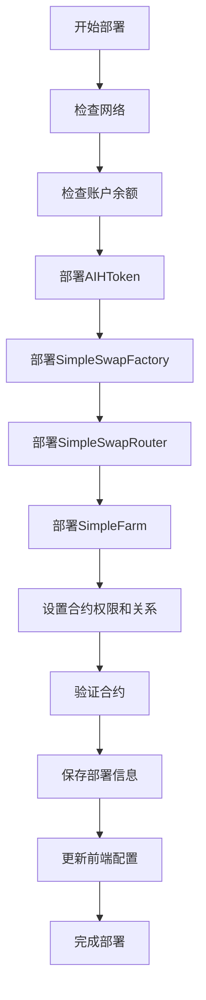

# AIHarvest 2.0 部署脚本

本目录包含AIHarvest 2.0 DeFi平台的部署和管理脚本。

## 部署脚本

### deploy-full-system.js
基础部署脚本，用于部署完整的AIHarvest系统，包括AIHToken、SimpleSwapFactory、SimpleSwapRouter和SimpleFarm合约。

### deploy-sepolia.js
专门为Sepolia测试网优化的部署脚本，包含以下改进：

- 网络检测确保在正确的网络上部署
- 账户余额检查，确保有足够的测试币用于部署
- 测试网水龙头信息与提示
- 在部署关键合约后添加确认等待时间
- 自动合约验证（需配置ETHERSCAN_API_KEY）
- 部署信息保存，包括构造函数参数
- 自动生成前端配置
- 详细的部署后指南
- 更全面的错误处理

## 使用方法

### Sepolia测试网部署

准备工作：
1. 确保`.env`文件包含必要的环境变量：
   ```
   PRIVATE_KEY=你的私钥
   INFURA_PROJECT_ID=你的Infura项目ID
   ETHERSCAN_API_KEY=你的Etherscan API密钥
   ```

2. 确保部署账户有足够的Sepolia测试ETH

执行部署：
```bash
# 在contracts目录下
npm run deploy:sepolia
# 或者使用yarn
yarn deploy:sepolia
```

### 合约验证

如果配置了ETHERSCAN_API_KEY，脚本会自动验证合约。如果验证失败，可以使用打印出的命令手动验证。

## 部署后操作

成功部署后，建议执行以下操作：

1. 检查前端配置是否正确更新
2. 在Sepolia上部署测试用代币或使用现有代币
3. 添加初始流动性创建交易对
4. 配置Farm，添加LP代币池
5. 进行全面的功能测试

## 流程图

