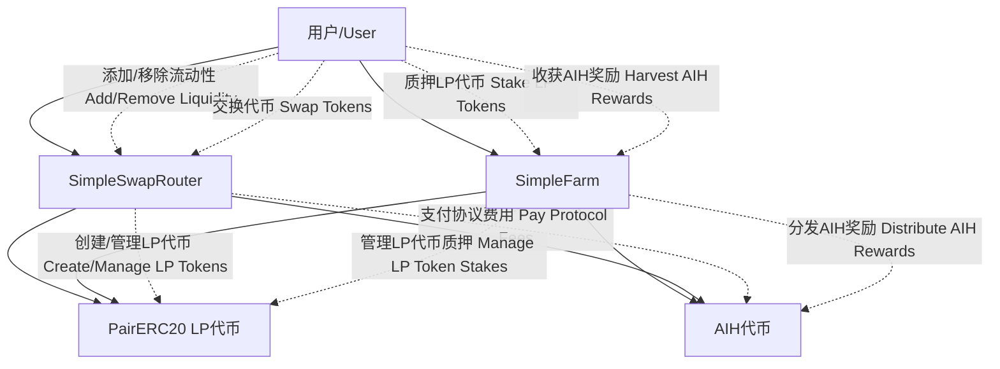

# AIHarvest 2.0 合约关系和用户流程分析
# AIHarvest 2.0 Contract Relationships and User Flow Analysis

## 合约概述 (Contract Overview)

AIHarvest 2.0 系统由四个主要合约组成：
The AIHarvest 2.0 system consists of four main contracts:

1. **AIHToken.sol** - 平台的原生代币合约
   **AIHToken.sol** - The platform's native token contract

2. **PairERC20.sol** - LP代币合约，为每个交易对提供ERC20兼容的流动性代币
   **PairERC20.sol** - LP token contract, providing ERC20-compatible liquidity tokens for each trading pair

3. **SimpleSwapRouter.sol** - DEX的核心路由合约，处理交易对创建、流动性管理和代币交换
   **SimpleSwapRouter.sol** - Core DEX router contract, handling pair creation, liquidity management, and token swaps

4. **SimpleFarm.sol** - 质押合约，允许用户质押LP代币以获得AIH奖励
   **SimpleFarm.sol** - Staking contract, allowing users to stake LP tokens for AIH rewards

## 合约间关系 (Contract Relationships)

## 用户交互流程 (User Interaction Flow)

### 1. 流动性管理流程 (Liquidity Management Flow)

#### 添加流动性 (Adding Liquidity)
1. 用户调用 `SimpleSwapRouter.addLiquidity`，提供两种代币和期望数量
   User calls `SimpleSwapRouter.addLiquidity`, providing two tokens and desired amounts

2. 如果交易对不存在，Router自动创建新的交易对和对应的LP代币
   If the pair doesn't exist, Router automatically creates a new pair and corresponding LP token

3. Router计算最优添加数量，转移用户的代币到合约
   Router calculates optimal amounts, transfers user's tokens to the contract

4. Router更新储备量，铸造LP代币并转给用户
   Router updates reserves, mints LP tokens and transfers them to the user

5. LP代币作为ERC20代币可以在用户钱包中查看
   LP tokens as ERC20 tokens can be viewed in the user's wallet

#### 移除流动性 (Removing Liquidity)
1. 用户调用 `SimpleSwapRouter.removeLiquidity`，指定要销毁的LP代币数量
   User calls `SimpleSwapRouter.removeLiquidity`, specifying the amount of LP tokens to burn

2. Router计算应返回的代币数量，销毁LP代币
   Router calculates token amounts to return, burns LP tokens

3. Router更新储备量，将两种原始代币转回给用户
   Router updates reserves, transfers both original tokens back to the user

### 2. 代币交换流程 (Token Swap Flow)

1. 用户调用 `SimpleSwapRouter.swapExactTokensForTokens`
   User calls `SimpleSwapRouter.swapExactTokensForTokens`

2. Router计算输出金额，包括扣除的交换费用
   Router calculates output amount, including deducted swap fees

3. Router更新储备量，将输出代币发送给用户
   Router updates reserves, sends output tokens to the user

4. 部分交换费用作为协议费用被收集
   A portion of swap fees is collected as protocol fees

### 3. 农场质押流程 (Farm Staking Flow)

#### 质押LP代币 (Staking LP Tokens)
1. 用户批准Farm合约使用其LP代币
   User approves Farm contract to use their LP tokens

2. 用户调用 `SimpleFarm.deposit`，指定池子ID和数量
   User calls `SimpleFarm.deposit`, specifying pool ID and amount

3. Farm合约将LP代币从用户转移到自己
   Farm contract transfers LP tokens from user to itself

4. 更新用户在Farm中的记录和奖励计算
   Updates user's records and reward calculations in Farm

#### 提取LP代币和奖励 (Withdrawing LP Tokens and Rewards)
1. 用户调用 `SimpleFarm.withdraw` 或 `SimpleFarm.harvest`
   User calls `SimpleFarm.withdraw` or `SimpleFarm.harvest`

2. Farm计算并发送应得的AIH奖励
   Farm calculates and sends deserved AIH rewards

3. 如果是提取，Farm将LP代币返回给用户
   If withdrawing, Farm returns LP tokens to the user

### 4. Farm与Router交互 (Farm and Router Interaction)

1. Farm合约可以调用 `SimpleSwapRouter.farmRemoveLiquidity`
   Farm contract can call `SimpleSwapRouter.farmRemoveLiquidity`

2. 这让Farm能代表用户移除流动性，支持复杂的自动化流程
   This allows Farm to remove liquidity on behalf of users, supporting complex automated workflows

## 关键合约功能分析 (Key Contract Functionality Analysis)

### AIHToken.sol
- 总供应量10亿，分配为：15%团队，30%生态系统，55%社区/农场
  Total supply of 1 billion, allocated as: 15% team, 30% ecosystem, 55% community/farming
- 团队和生态系统代币有2年线性解锁期
  Team and ecosystem tokens have a 2-year linear vesting period
- 只有Farm合约可以铸造新代币，防止超出最大供应
  Only Farm contract can mint new tokens, preventing exceeding max supply

### PairERC20.sol
- 为每个交易对创建独特的ERC20 LP代币
  Creates unique ERC20 LP tokens for each trading pair
- Router是所有者，可以铸造和销毁LP代币
  Router is the owner, can mint and burn LP tokens
- 兼容ERC20标准，可在MetaMask等钱包中显示
  Compatible with ERC20 standard, displayable in MetaMask and other wallets

### SimpleSwapRouter.sol
- 创建和管理交易对，为每对铸造LP代币
  Creates and manages trading pairs, mints LP tokens for each pair
- 处理流动性管理（添加/移除）
  Handles liquidity management (adding/removing)
- 执行代币交换并计算价格影响
  Executes token swaps and calculates price impact
- 收取交易费用，部分作为协议费用
  Collects trading fees, part as protocol fees
- 提供farmRemoveLiquidity方法为Farm交互
  Provides farmRemoveLiquidity method for Farm interaction

### SimpleFarm.sol
- 允许用户质押LP代币赚取AIH奖励
  Allows users to stake LP tokens to earn AIH rewards
- 支持多池子，每个池子有不同分配点数
  Supports multiple pools, each with different allocation points
- 计算和分发基于时间的AIH奖励
  Calculates and distributes time-based AIH rewards
- 使用SafeERC20安全与LP代币交互
  Uses SafeERC20 to safely interact with LP tokens

## 安全考虑 (Security Considerations)

1. **权限管理** - 所有关键功能都有适当的权限检查
   **Permission Management** - All critical functions have appropriate permission checks

2. **可重入保护** - Farm合约使用ReentrancyGuard防止重入攻击
   **Reentrancy Protection** - Farm contract uses ReentrancyGuard to prevent reentrancy attacks

3. **代币安全** - 使用SafeERC20库进行代币转账
   **Token Safety** - Uses SafeERC20 library for token transfers

4. **溢出保护** - 使用Solidity 0.8+内置的溢出检查
   **Overflow Protection** - Uses Solidity 0.8+ built-in overflow checks 