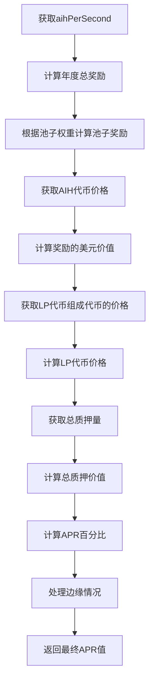

# Farm APR Calculation Mechanism
# 农场APR计算机制

This document explains how Annual Percentage Rate (APR) is calculated in the AIHarvest Farming system.

本文档解释了AIHarvest农场系统中年化收益率(APR)的计算方式。

## Overview
## 概述

APR in yield farming represents the annualized yield a user can expect to earn by staking their LP tokens in a farm pool. It's calculated based on:

农场挖矿中的APR代表了用户通过在农场池中质押LP代币可以预期获得的年化收益。它基于以下因素计算：

1. The reward token emission rate
2. The price of the reward token
3. The total value of staked assets in the pool
4. The allocation points assigned to the pool

1. 奖励代币的发放速率
2. 奖励代币的价格
3. 池中质押资产的总价值
4. 分配给池的权重点数

## Calculation Formula
## 计算公式

The basic formula to calculate APR is:

计算APR的基本公式是：

```
APR = (Yearly Rewards Value / Total Staked Value) * 100%
```

Where:
其中：

- Yearly Rewards Value: The USD value of all rewards distributed to the pool over a year
- Total Staked Value: The USD value of all LP tokens staked in the pool
- 年度奖励价值：一年内分配给池子的所有奖励的美元价值
- 总质押价值：池子中所有质押的LP代币的美元价值

## Detailed Implementation
## 详细实现

### 1. Calculate Yearly Rewards
### 1. 计算年度奖励

```typescript
// Get AIH per second from the contract
const aihPerSecond = await farmContract.aihPerSecond();

// Calculate AIH rewards per year for the entire farm
const aihPerYear = aihPerSecond.mul(3600 * 24 * 365);

// Get the pool's allocation points and total allocation points
const poolInfo = await getPoolInfo(provider, poolId);
const totalAllocPoint = await calculateTotalAllocPoint(provider);

// Calculate this pool's share of the yearly rewards
const poolRewardsPerYear = aihPerYear.mul(poolInfo.allocPoint).div(totalAllocPoint);

// Convert to a normal number
const yearlyRewardsInAIH = parseFloat(ethers.utils.formatEther(poolRewardsPerYear));
```

### 2. Calculate Rewards Value in USD
### 2. 计算奖励的美元价值

```typescript
// Get AIH token price from price simulation
const aihPrice = getTokenPrice('AIH') || 0.01; // Default if unavailable

// Calculate yearly rewards value in USD
const yearlyRewardsValue = yearlyRewardsInAIH * aihPrice;
```

### 3. Calculate LP Token Price
### 3. 计算LP代币价格

```typescript
// Get prices of the token pair that makes up the LP token
const priceA = getTokenPrice(tokenA);
const priceB = getTokenPrice(tokenB);

// Calculate LP token price based on its composition
// In our implementation, we use a simplified model where
// each LP token represents a certain amount of each underlying token
const tokenAAmount = 0.1; // Amount of tokenA per LP token
const tokenBAmount = (tokenAAmount * priceA) / priceB; // Equivalent amount of tokenB

// The LP token's value is the sum of its components
let lpTokenPrice = (tokenAAmount * priceA) + (tokenBAmount * priceB);

// We add a premium for accumulated trading fees
lpTokenPrice *= 1.05; // 5% premium for trading fees
```

### 4. Calculate Total Staked Value
### 4. 计算总质押价值

```typescript
// Get the total amount of LP tokens staked
const totalStakedLP = parseFloat(ethers.utils.formatEther(poolInfo.totalStaked));

// Calculate total staked value in USD
const totalStakedValue = totalStakedLP * lpTokenPrice;
```

### 5. Calculate APR
### 5. 计算APR

```typescript
// Calculate APR as a percentage
let apr = (yearlyRewardsValue / totalStakedValue) * 100;

// Handle edge cases
if (isNaN(apr) || !isFinite(apr)) {
  apr = 350; // Default if calculation fails
} else if (apr < 0) {
  apr = 0; // APR can't be negative
}
```

## Price Simulation
## 价格模拟

In our development environment, we use a price simulation system to provide realistic token prices:

在我们的开发环境中，我们使用价格模拟系统来提供真实的代币价格：

```typescript
// Token price ranges for simulation
export const priceRanges = {
  TD: [9.5, 10.5],
  FHBI: [45, 55],
  FHBI2: [22, 28],
  FHBI3: [8, 12],
  RTK: [1.5, 2.5],
  AIH: [0.008, 0.012],
};

// Get current price for a specific token
export const getTokenPrice = (token: string): number | undefined => {
  if (isValidTokenSymbol(token)) {
    return priceState.prices[token];
  }
  return undefined;
};

// Update prices with small random fluctuations
export const updateAllPrices = (): void => {
  Object.keys(priceRanges).forEach((token) => {
    const tokenSymbol = token as TokenSymbol;
    const currentPrice = priceState.prices[tokenSymbol];
    const randomPrice = generateRandomPrice(tokenSymbol);
    
    // Limit change to max 2% for smooth transitions
    const maxChange = currentPrice * 0.02;
    const difference = randomPrice - currentPrice;
    const limitedDifference = Math.max(Math.min(difference, maxChange), -maxChange);
    
    priceState.prices[tokenSymbol] = currentPrice + limitedDifference;
  });
};
```

## Key Factors Affecting APR
## 影响APR的关键因素

1. **Reward Token Emission Rate**: Higher `aihPerSecond` values increase APR
2. **Reward Token Price**: Higher AIH price increases APR
3. **LP Token Price**: Higher LP token prices decrease APR
4. **Total Staked Amount**: More tokens staked in the pool decreases APR
5. **Pool Allocation Points**: Higher allocation points relative to other pools increases APR

1. **奖励代币发放速率**：更高的`aihPerSecond`值会增加APR
2. **奖励代币价格**：更高的AIH价格会增加APR
3. **LP代币价格**：更高的LP代币价格会降低APR
4. **总质押量**：池中质押的代币越多，APR越低
5. **池子分配点数**：相对于其他池子更高的分配点数会增加APR

## Implementation Notes
## 实现说明

- Our implementation does not impose artificial caps on APR values, allowing the true calculated value to be displayed
- In production environments, the emission rate (`aihPerSecond`) should be set to a sustainable value that provides attractive but realistic APRs
- The APR calculation is updated whenever token prices change, providing dynamic and responsive rates

- 我们的实现不对APR值施加人为上限，允许显示真实计算的值
- 在生产环境中，发放速率(`aihPerSecond`)应设置为可持续的值，提供有吸引力但合理的APR
- 每当代币价格变化时，APR计算都会更新，提供动态和响应式的收益率

## Flowchart
## 流程图

