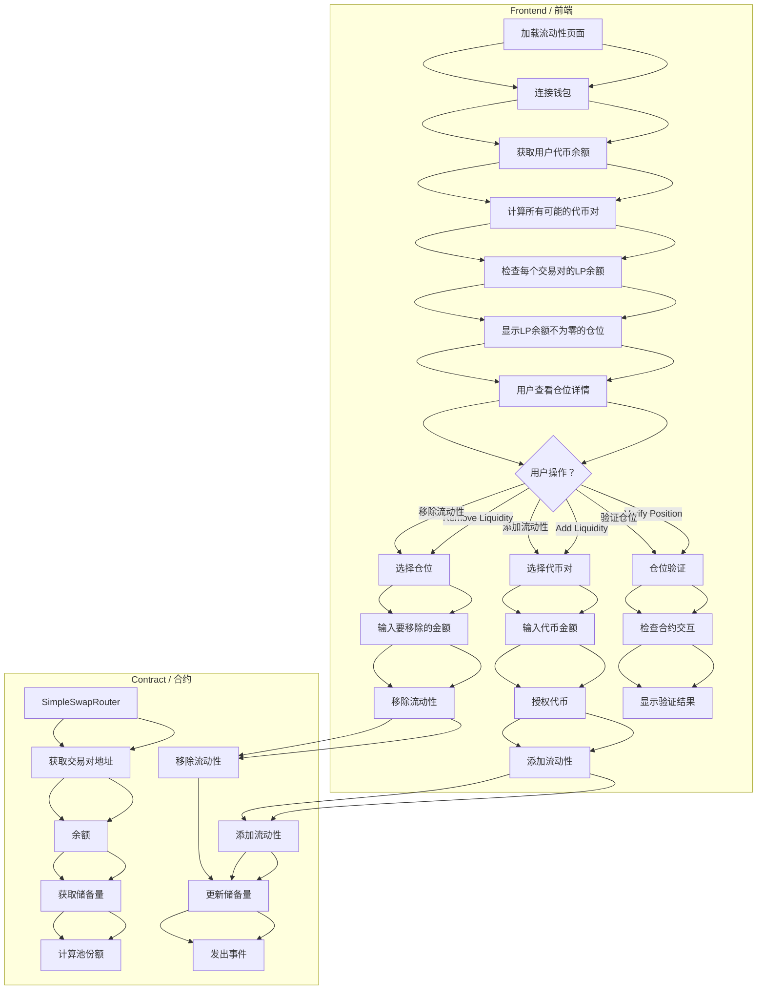

# AIHarvest 2.0 Liquidity Position Management
# AIHarvest 2.0 流动性仓位管理

## Liquidity Position Management Process
## 流动性仓位管理流程

AIHarvest 2.0 provides a comprehensive system for managing liquidity positions:

AIHarvest 2.0 提供了全面的流动性仓位管理系统：

### Viewing Positions / 查看仓位

1. When a user connects their wallet to the liquidity page, the system:
   当用户将钱包连接到流动性页面时，系统会：

   - Generate all possible token pairs from the available tokens
     从可用代币生成所有可能的代币对
   
   - Query the router contract for LP token balances for each pair
     查询每个交易对的路由器合约以获取LP代币余额
   
   - Display only positions with non-zero LP balance
     只显示LP余额不为零的仓位
   
   - Calculate pool share percentage for each position
     计算每个仓位的池份额百分比

2. For each position, users can see:
   对于每个仓位，用户可以看到：

   - The tokens in the pair with their symbols and logos
     交易对中的代币及其符号和标志
   
   - Amount of each token in the position
     仓位中每种代币的金额
   
   - Their share of the pool as a percentage
     作为百分比的池份额
   
   - The pair's contract address
     交易对的合约地址

### Adding Liquidity / 添加流动性

1. Users select two tokens and enter the amounts to provide
   用户选择两个代币并输入要提供的金额

2. The system calculates the optimal amounts based on the current pool ratio (if the pair exists)
   系统根据当前池比率计算最佳金额（如果交易对存在）

3. Users approve token spending for the router contract
   用户批准路由器合约的代币支出

4. Upon adding liquidity, users receive LP tokens representing their share of the pool
   添加流动性后，用户收到代表其池份额的LP代币

### Removing Liquidity / 移除流动性

1. Users select a position and choose to remove part or all of their liquidity
   用户选择一个仓位并选择移除部分或全部流动性

2. The system calculates the expected token amounts to receive
   系统计算预计收到的代币金额

3. A slippage tolerance is applied to protect against price movements
   应用滑点容忍度以防止价格波动

4. Upon removal, users receive the underlying tokens and their LP tokens are burned
   移除后，用户收到底层代币，其LP代币被销毁

### Position Verification / 仓位验证

The system provides a verification tool to validate liquidity positions:

系统提供验证工具来验证流动性仓位：

1. Checks if token addresses are valid contracts
   检查代币地址是否为有效合约

2. Verifies the pair address against the router's getPairAddress function
   根据路由器的getPairAddress函数验证交易对地址

3. Confirms LP token information (name, symbol, decimals)
   确认LP代币信息（名称、符号、小数位）

4. Validates the user's LP token balance
   验证用户的LP代币余额

This helps prevent interaction with fraudulent or compromised liquidity pools.

这有助于防止与欺诈或受损的流动性池交互。 