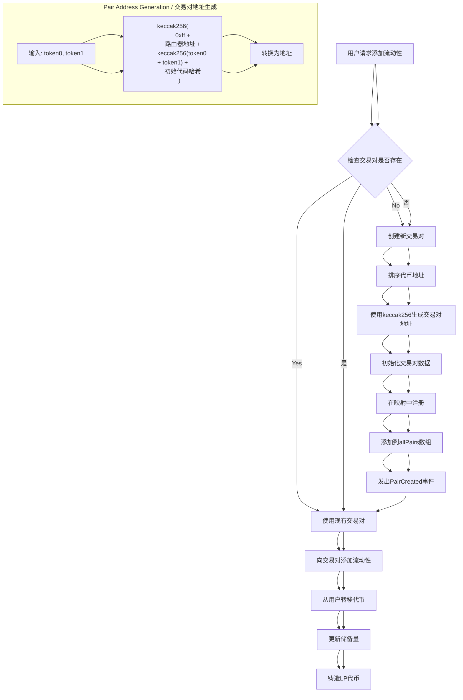

# AIHarvest 2.0 Pair Creation Mechanism
# AIHarvest 2.0 交易对创建机制



## The Deterministic Pair Creation Process
## 确定性交易对创建过程

The SimpleSwapRouter contract creates liquidity pairs through a deterministic process:

SimpleSwapRouter合约通过确定性过程创建流动性交易对：

1. When a user adds liquidity with two tokens that don't have an existing pair
   当用户添加两个没有现有交易对的代币的流动性时

2. The contract sorts the token addresses (smaller address becomes token0)
   合约对代币地址进行排序（较小的地址成为token0）

3. It generates a deterministic address using the CREATE2 pattern:
   它使用CREATE2模式生成确定性地址：
   ```
   address = keccak256(0xff + router_address + salt + init_code_hash)
   ```
   Where salt is keccak256(token0 + token1)
   其中salt是keccak256(token0 + token1)

4. The new pair is initialized in the contract's storage
   新的交易对在合约的存储中初始化

5. The pair is registered in mappings for easy lookup
   交易对在映射中注册以便于查找

6. A PairCreated event is emitted with the pair details
   发出包含交易对详细信息的PairCreated事件

This approach ensures that pair addresses are consistent and can be pre-computed off-chain.

这种方法确保交易对地址是一致的，并且可以在链下预先计算。 