# AIHarvest 2.0 用户交互流程图
# AIHarvest 2.0 User Interaction Flow Diagram

```mermaid
sequenceDiagram
    actor User
    participant Frontend
    participant Wallet as 用户钱包/User Wallet
    participant Router as SimpleSwapRouter
    participant PairToken as PairERC20 LP代币
    participant Farm as SimpleFarm
    participant AIH as AIHToken

    %% 连接钱包
    User->>Frontend: 连接钱包<br>Connect wallet
    Frontend->>Wallet: 请求连接<br>Request connection
    Wallet-->>Frontend: 授权连接<br>Authorize connection
    Frontend-->>User: 显示钱包地址和余额<br>Display address & balances

    %% 添加流动性
    User->>Frontend: 选择代币对添加流动性<br>Select token pair to add liquidity
    Frontend->>Wallet: 请求代币授权<br>Request token approvals
    Wallet-->>Router: 批准Router使用代币<br>Approve Router to use tokens
    User->>Frontend: 确认添加流动性<br>Confirm add liquidity
    Frontend->>Router: 调用addLiquidity()<br>Call addLiquidity()
    
    alt 交易对不存在 (Pair doesn't exist)
        Router->>Router: 创建新交易对<br>Create new pair
        Router->>PairToken: 创建新LP代币<br>Create new LP token
    end
    
    Router->>Router: 计算最优添加数量<br>Calculate optimal amounts
    Router->>Wallet: 转移用户代币到合约<br>Transfer user tokens to contract
    Router->>Router: 更新储备量<br>Update reserves
    Router->>PairToken: 铸造LP代币<br>Mint LP tokens
    PairToken-->>Wallet: 发送LP代币给用户<br>Send LP tokens to user
    Frontend-->>User: 显示LP代币余额<br>Display LP token balance

    %% 质押LP代币到Farm
    User->>Frontend: 选择Farm池子<br>Select Farm pool
    Frontend->>Wallet: 请求LP代币授权<br>Request LP token approval
    Wallet-->>Farm: 批准Farm使用LP代币<br>Approve Farm to use LP tokens
    User->>Frontend: 确认质押<br>Confirm staking
    Frontend->>Farm: 调用deposit()<br>Call deposit()
    Farm->>Wallet: 转移LP代币到Farm<br>Transfer LP tokens to Farm
    Farm->>Farm: 更新用户信息和奖励<br>Update user info & rewards
    Frontend-->>User: 显示质押状态<br>Display staking status

    %% 收获奖励
    User->>Frontend: 查看待收获奖励<br>View pending rewards
    Frontend->>Farm: 调用pendingAIH()<br>Call pendingAIH()
    Farm-->>Frontend: 返回待收获数量<br>Return pending amount
    User->>Frontend: 点击收获<br>Click harvest
    Frontend->>Farm: 调用harvest()<br>Call harvest()
    Farm->>Farm: 计算奖励<br>Calculate rewards
    Farm->>AIH: 调用transfer()<br>Call transfer()
    AIH-->>Wallet: 发送AIH奖励给用户<br>Send AIH rewards to user
    Frontend-->>User: 显示收获成功<br>Display harvest success

    %% 从Farm提取LP代币
    User->>Frontend: 点击提取LP代币<br>Click withdraw LP tokens
    Frontend->>Farm: 调用withdraw()<br>Call withdraw()
    Farm->>Farm: 计算奖励<br>Calculate rewards
    Farm->>AIH: 调用transfer()<br>Call transfer()
    AIH-->>Wallet: 发送AIH奖励给用户<br>Send AIH rewards to user
    Farm->>Wallet: 返还LP代币给用户<br>Return LP tokens to user
    Frontend-->>User: 显示提取成功<br>Display withdraw success

    %% 移除流动性
    User->>Frontend: 选择移除流动性<br>Select remove liquidity
    Frontend->>Wallet: 请求LP代币授权<br>Request LP token approval
    Wallet-->>Router: 批准Router使用LP代币<br>Approve Router to use LP tokens
    User->>Frontend: 确认移除流动性<br>Confirm remove liquidity
    Frontend->>Router: 调用removeLiquidity()<br>Call removeLiquidity()
    Router->>PairToken: 销毁LP代币<br>Burn LP tokens
    Router->>Router: 计算返还代币数量<br>Calculate token amounts to return
    Router->>Router: 更新储备量<br>Update reserves
    Router->>Wallet: 返还原始代币给用户<br>Return original tokens to user
    Frontend-->>User: 显示移除成功<br>Display remove success

    %% 交换代币
    User->>Frontend: 选择交换代币<br>Select swap tokens
    Frontend->>Wallet: 请求输入代币授权<br>Request input token approval
    Wallet-->>Router: 批准Router使用输入代币<br>Approve Router to use input token
    User->>Frontend: 确认交换<br>Confirm swap
    Frontend->>Router: 调用swapExactTokensForTokens()<br>Call swapExactTokensForTokens()
    Router->>Router: 计算输出金额和费用<br>Calculate output amount & fees
    Router->>Router: 更新储备量<br>Update reserves
    Router->>Wallet: 发送输出代币给用户<br>Send output tokens to user
    Router->>AIH: 收集部分费用<br>Collect portion of fees
    Frontend-->>User: 显示交换成功<br>Display swap success
```

## 用户交互流程说明
## User Interaction Flow Description

### 1. 连接钱包 (Connect Wallet)
用户首先需要连接MetaMask或其他Web3钱包到前端应用。
First, users need to connect MetaMask or other Web3 wallets to the frontend application.

### 2. 添加流动性 (Add Liquidity)
1. 用户选择两种代币和添加数量
   User selects two tokens and amount to add
2. 批准Router合约使用这些代币
   Approve Router contract to use these tokens
3. 确认交易，Router创建交易对（如果不存在）并铸造LP代币
   Confirm transaction, Router creates the pair (if not exists) and mints LP tokens

### 3. 质押LP代币到Farm (Stake LP Tokens to Farm)
1. 用户选择要质押的Farm池子
   User selects which Farm pool to stake in
2. 批准Farm合约使用LP代币
   Approve Farm contract to use LP tokens
3. 确认质押交易，Farm记录用户质押信息
   Confirm staking transaction, Farm records user staking information

### 4. 收获Farm奖励 (Harvest Farm Rewards)
1. 用户查看待收获的AIH奖励
   User views pending AIH rewards
2. 点击收获按钮，Farm计算并发送奖励
   Click harvest button, Farm calculates and sends rewards

### 5. 从Farm提取LP代币 (Withdraw LP Tokens from Farm)
1. 用户选择提取LP代币数量
   User selects amount of LP tokens to withdraw
2. 确认提取交易，Farm返还LP代币并发送累积奖励
   Confirm withdrawal transaction, Farm returns LP tokens and sends accumulated rewards

### 6. 移除流动性 (Remove Liquidity)
1. 用户选择要移除的LP代币数量
   User selects amount of LP tokens to remove
2. 批准Router使用LP代币
   Approve Router to use LP tokens
3. 确认移除交易，Router销毁LP代币并返还原始代币
   Confirm removal transaction, Router burns LP tokens and returns original tokens

### 7. 交换代币 (Swap Tokens)
1. 用户选择输入代币、输出代币和交换数量
   User selects input token, output token, and swap amount
2. 批准Router使用输入代币
   Approve Router to use input token
3. 确认交换交易，Router执行交换并收取费用
   Confirm swap transaction, Router executes swap and collects fees 