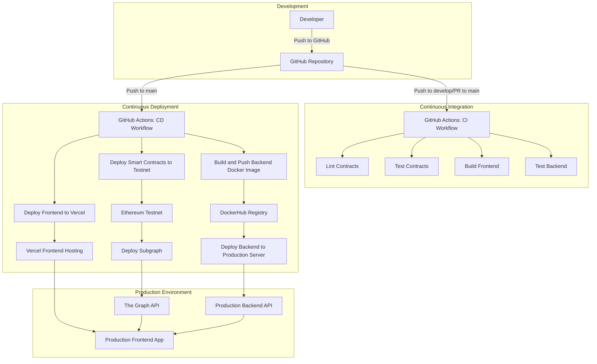
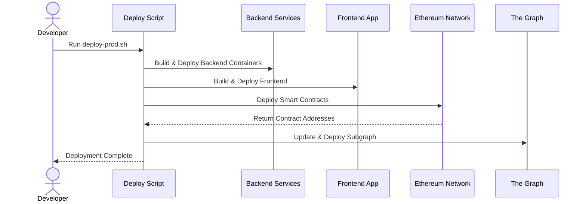

# AIHarvest 2.0 CI/CD Workflow

The following diagram illustrates the CI/CD workflow for the AIHarvest 2.0 project:

## CI/CD Process Flow

1. **Development**:
   - Developers work on feature branches
   - Push changes to GitHub repository

2. **Continuous Integration**:
   - Triggered on push to develop branch or PR to main
   - Runs linting, tests, and builds for all components
   - Ensures code quality and functionality

3. **Continuous Deployment**:
   - Triggered only on push to main branch
   - Builds and publishes Docker images
   - Deploys frontend to Vercel
   - Deploys contracts to testnet (if enabled)
   - Updates subgraph indexing

4. **Production Environment**:
   - Frontend hosted on Vercel
   - Backend running in Docker containers on cloud servers
   - Smart contracts deployed on Ethereum network
   - Subgraph indexing data on The Graph protocol

## Manual Deployment

In some cases, manual deployment may be preferred:

