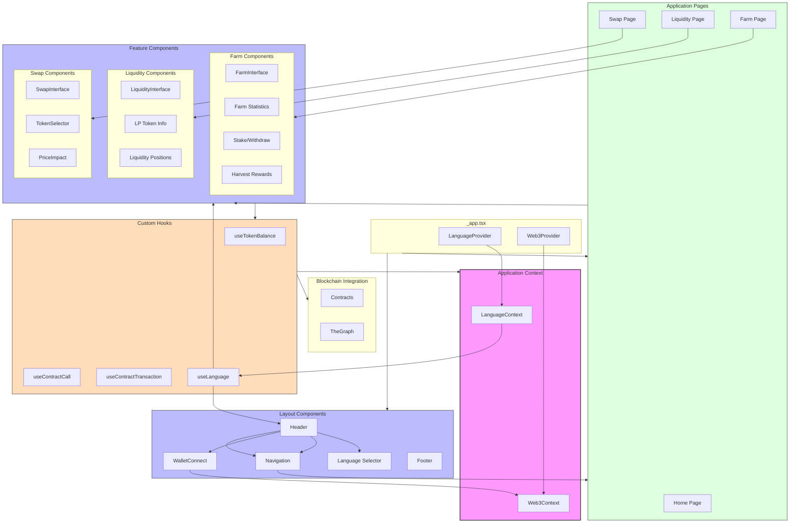

# AIHarvest Frontend Architecture Diagram
# AIHarvest前端架构图

The following diagram illustrates the architecture of the AIHarvest frontend application, showing the relationships between key components, data flow, and language context.

以下图表展示了AIHarvest前端应用程序的架构，显示了关键组件之间的关系、数据流和语言上下文。

## Architecture Description
## 架构描述

1. **Application Wrapper (_app.tsx)**
   - Provides core providers: LanguageProvider and Web3Provider 
   - Sets up global layout and context

1. **应用包装器 (_app.tsx)**
   - 提供核心提供者：LanguageProvider和Web3Provider
   - 设置全局布局和上下文

2. **Context Providers**
   - LanguageContext: Manages the current language setting (EN/中文)
   - Web3Context: Manages wallet connection and blockchain state

2. **上下文提供者**
   - LanguageContext：管理当前语言设置（EN/中文）
   - Web3Context：管理钱包连接和区块链状态

3. **Layout Components**
   - Header: Contains language selector, navigation, and wallet connection
   - Footer: Contains links and information in both languages

3. **布局组件**
   - Header：包含语言选择器、导航和钱包连接
   - Footer：包含两种语言的链接和信息

4. **Page Components**
   - Home Page: Landing page with overview
   - Swap Page: Token swap functionality
   - Liquidity Page: Liquidity provision management
   - Farm Page: Yield farming interface

4. **页面组件**
   - 首页：具有概览的登录页面
   - 交换页面：代币交换功能
   - 流动性页面：流动性提供管理
   - 农场页面：收益耕作界面

5. **Feature Components**
   - Organized by feature (Swap, Liquidity, Farm)
   - Each set handles specific functionality for that feature
   - All feature components consume language context for translations

5. **功能组件**
   - 按功能组织（交换、流动性、农场）
   - 每组处理该功能的特定功能
   - 所有功能组件使用语言上下文进行翻译

6. **Custom Hooks**
   - useLanguage: Access to current language and translation functions
   - useTokenBalance: Fetches token balances
   - useContractCall: Reads data from blockchain
   - useContractTransaction: Writes data to blockchain

6. **自定义钩子**
   - useLanguage：访问当前语言和翻译函数
   - useTokenBalance：获取代币余额
   - useContractCall：从区块链读取数据
   - useContractTransaction：向区块链写入数据

7. **Blockchain Integration**
   - Direct contract interaction
   - Indexed data via TheGraph

7. **区块链集成**
   - 直接合约交互
   - 通过TheGraph索引数据

The architecture follows a modular approach with clear separation of concerns, making it maintainable and extensible. All UI components support bilingual interfaces through the language context, and all blockchain interactions are abstracted through custom hooks.

该架构采用模块化方法，明确关注点分离，使其易于维护和扩展。所有UI组件通过语言上下文支持双语界面，所有区块链交互都通过自定义钩子进行抽象。 