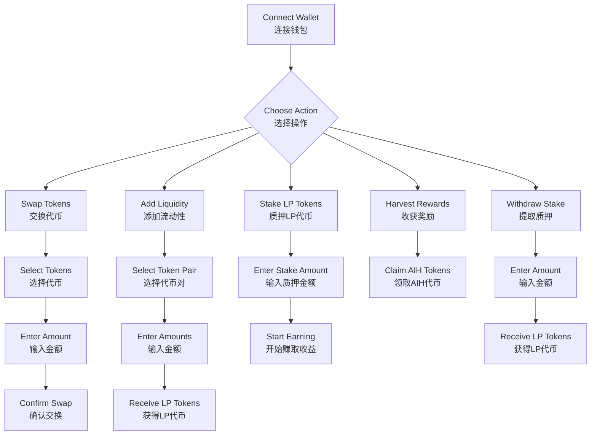
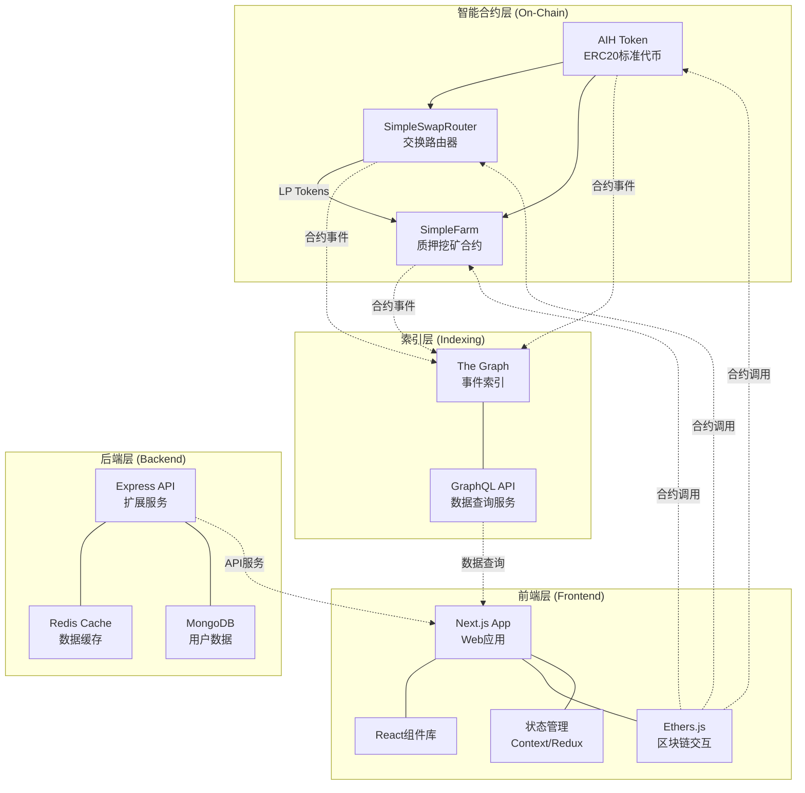

### 1.2 核心用户与用户路径

**核心用户画像**:
1. DeFi初学者 - 希望通过简单操作参与加密货币收益的新用户
2. 流动性提供者 - 希望通过提供资金获取交易费和奖励的投资者
3. 交易者 - 需要在不同代币间进行交换的用户

**典型用户路径**:




### 2.1 核心模块组成



The architecture consists of four layers: smart contracts, data indexing, backend services, and frontend application.
架构由四层组成：智能合约、数据索引、后端服务和前端应用。

### 2.2 数据流与调用路径

```mermaid
sequenceDiagram

    actor User as User (用户)

    participant Frontend as Frontend (前端)<br>Next.js App

    participant Backend as Backend (后端)<br>Express API

    participant TheGraph as Indexing (索引)<br>The Graph

    participant Contracts as Contracts (合约)<br>AIH/Swap/Farm

    participant Blockchain as Blockchain (区块链)

  

    %% 初始加载流程 (Initial Loading)

    User->>Frontend: Access Platform (访问平台)

    Frontend->>TheGraph: Query Platform Data (查询平台数据)<br>GraphQL

    TheGraph->>Frontend: Return Platform Stats (返回平台统计)

    Frontend->>Backend: Request User Data (请求用户数据)<br>REST API

    Backend->>Frontend: Return User Preferences (返回用户偏好)

    Frontend-->>User: Display Dashboard (显示仪表板)

    %% 钱包连接 (Wallet Connection)

    User->>Frontend: Connect Wallet (连接钱包)

    Frontend->>Blockchain: Request Accounts (请求账户)

    Blockchain-->>Frontend: Return Account Info (返回账户信息)

    Frontend->>TheGraph: Query User Positions (查询用户头寸)

    TheGraph-->>Frontend: Return User Balances & Stakes (返回用户余额和质押)

    Frontend-->>User: Update UI with Wallet Data (更新UI显示钱包数据)

    %% 代币交换流程 (Token Swap)

    User->>Frontend: Select Token Pair (选择代币对)

    Frontend->>TheGraph: Query Exchange Rate (查询汇率)

    TheGraph-->>Frontend: Return Current Rate (返回当前汇率)

    User->>Frontend: Enter Swap Amount (输入交换金额)

    Frontend->>Contracts: Call getOutputAmount() (调用获取输出金额)

    Contracts-->>Frontend: Return Expected Output (返回预期输出)

    Frontend-->>User: Display Swap Preview (显示交换预览)

    User->>Frontend: Confirm Swap (确认交换)

    Frontend->>Contracts: Call approve() for Token A (为代币A调用approve)

    Contracts->>Blockchain: Record Token Approval (记录代币授权)

    Blockchain-->>Frontend: Confirm Approval (确认授权)

    Frontend->>Contracts: Call swap() on SimpleSwapRouter (调用交换路由的swap函数)

    Contracts->>Blockchain: Execute Swap (执行交换)

    Blockchain-->>Contracts: Confirm Transaction (确认交易)

    Contracts-->>Frontend: Return Transaction Result (返回交易结果)

    Blockchain->>TheGraph: Emit Swap Event (发出交换事件)

    TheGraph->>Backend: Update Indexed Data (更新索引数据)

    Frontend->>TheGraph: Query Updated Balances (查询更新的余额)

    TheGraph-->>Frontend: Return New Balances (返回新余额)

    Frontend-->>User: Display Swap Completion (显示交换完成)

    %% 提供流动性流程 (Add Liquidity)

    User->>Frontend: Select Tokens for Liquidity (选择流动性代币)

    Frontend->>TheGraph: Query Pair Info (查询交易对信息)

    TheGraph-->>Frontend: Return Pair Data (返回交易对数据)

    User->>Frontend: Enter Liquidity Amounts (输入流动性金额)

    Frontend-->>User: Display Liquidity Preview (显示流动性预览)

    User->>Frontend: Confirm Add Liquidity (确认添加流动性)

    Frontend->>Contracts: Call approve() for Token A (为代币A调用approve)

    Contracts->>Blockchain: Record Token A Approval (记录代币A授权)

    Frontend->>Contracts: Call approve() for Token B (为代币B调用approve)

    Contracts->>Blockchain: Record Token B Approval (记录代币B授权)

    Frontend->>Contracts: Call addLiquidity() (调用添加流动性)

    Contracts->>Blockchain: Add Liquidity (添加流动性)

    Blockchain-->>Contracts: Mint LP Tokens (铸造LP代币)

    Contracts-->>Frontend: Return LP Token Amount (返回LP代币数量)

    Blockchain->>TheGraph: Emit Liquidity Added Event (发出添加流动性事件)

    TheGraph->>Backend: Update Liquidity Data (更新流动性数据)

    Frontend->>TheGraph: Query LP Balance (查询LP余额)

    TheGraph-->>Frontend: Return LP Balance (返回LP余额)

    Frontend-->>User: Display LP Tokens Received (显示收到的LP代币)

    %% 质押LP代币流程 (Stake LP Tokens)

    User->>Frontend: Navigate to Farm (导航到农场)

    Frontend->>TheGraph: Query Farm Data (查询农场数据)

    TheGraph-->>Frontend: Return Farm Stats (返回农场统计)

    User->>Frontend: Enter Stake Amount (输入质押金额)

    Frontend-->>User: Display Staking Preview (显示质押预览)

    User->>Frontend: Confirm Stake (确认质押)

    Frontend->>Contracts: Call approve() for LP Token (为LP代币调用approve)

    Contracts->>Blockchain: Record LP Approval (记录LP授权)

    Frontend->>Contracts: Call deposit() on SimpleFarm (调用SimpleFarm的deposit函数)

    Contracts->>Blockchain: Record Stake (记录质押)

    Blockchain-->>Contracts: Update Stake Position (更新质押头寸)

    Contracts-->>Frontend: Return Stake Confirmation (返回质押确认)

    Blockchain->>TheGraph: Emit Deposit Event (发出存款事件)

    TheGraph->>Backend: Update Staking Data (更新质押数据)

    Frontend->>TheGraph: Query Updated Stake (查询更新的质押)

    TheGraph-->>Frontend: Return Stake Position (返回质押头寸)

    Frontend-->>User: Display Staking Complete (显示质押完成)

    %% 收获奖励流程 (Harvest Rewards)

    User->>Frontend: Check Pending Rewards (查看待领取奖励)

    Frontend->>Contracts: Call pendingReward() (调用待领取奖励)

    Contracts-->>Frontend: Return Reward Amount (返回奖励金额)

    Frontend-->>User: Display Available Rewards (显示可用奖励)

    User->>Frontend: Harvest Rewards (收获奖励)

    Frontend->>Contracts: Call withdraw(0) or harvest() (调用withdraw(0)或harvest函数)

    Contracts->>Blockchain: Process Reward Transfer (处理奖励转账)

    Blockchain-->>Contracts: Transfer AIH Tokens (转移AIH代币)

    Contracts-->>Frontend: Confirm Harvest (确认收获)

    Blockchain->>TheGraph: Emit Harvest Event (发出收获事件)

    TheGraph->>Backend: Update Reward Data (更新奖励数据)

    Frontend->>TheGraph: Query Updated Balances (查询更新的余额)

    TheGraph-->>Frontend: Return New Balance (返回新余额)

    Frontend-->>User: Display Harvest Complete (显示收获完成)

    %% 提取质押流程 (Withdraw Stake)

    User->>Frontend: Navigate to My Stakes (导航到我的质押)

    Frontend->>TheGraph: Query User Stakes (查询用户质押)

    TheGraph-->>Frontend: Return Stake Positions (返回质押头寸)

    User->>Frontend: Enter Withdrawal Amount (输入提取金额)

    Frontend-->>User: Display Withdrawal Preview (显示提取预览)

    User->>Frontend: Confirm Withdrawal (确认提取)

    Frontend->>Contracts: Call withdraw() on SimpleFarm (调用SimpleFarm的withdraw函数)

    Contracts->>Blockchain: Process Withdrawal + Rewards (处理提款和奖励)

    Blockchain-->>Contracts: Transfer LP + AIH Tokens (转移LP和AIH代币)

    Contracts-->>Frontend: Confirm Withdrawal (确认提款)

    Blockchain->>TheGraph: Emit Withdraw Event (发出提款事件)

    TheGraph->>Backend: Update Stake Data (更新质押数据)

    Frontend->>TheGraph: Query Updated Positions (查询更新的头寸)

    TheGraph-->>Frontend: Return New Balances (返回新余额)

    Frontend-->>User: Display Withdrawal Complete (显示提款完成)

    %% 实时数据更新 (Real-time Updates)

    Blockchain->>TheGraph: Continuous Event Indexing (持续事件索引)

    TheGraph->>Backend: Update Analytics (更新分析)

    Backend->>Frontend: Push Updates via WebSocket (通过WebSocket推送更新)

    Frontend-->>User: Real-time UI Updates (实时UI更新)
```



The data flow starts with user interaction at the frontend, which triggers contract calls and blockchain transactions, then indexed for efficient retrieval.
数据流从用户在前端的交互开始，触发合约调用和区块链交易，然后被索引以便高效检索。


##  3. 技术实现层（Technical Implementation）

### 3.1 技术栈选择

**智能合约**:
- Solidity 0.8.19+
- Hardhat 开发环境
- OpenZeppelin 合约库
- Ethers.js 交互库

**前端**:
- Next.js 13+ (React框架)
- TypeScript
- TailwindCSS (样式)
- Wagmi/viem (钱包连接)
- React Query (数据获取)

**后端**:
- Node.js 18+
- Express.js (API服务)
- Redis (缓存)
- MongoDB (数据存储)

**数据索引**:
- The Graph Protocol
- GraphQL API

**基础设施**:
- Docker/Docker Compose
- GitHub Actions (CI/CD)
- Vercel/Netlify (前端部署)
- AWS/GCP (后端部署)

Our technology stack combines Solidity smart contracts, Next.js frontend, Node.js backend, and The Graph for data indexing.
我们的技术栈结合了Solidity智能合约、Next.js前端、Node.js后端和The Graph用于数据索引。

### 3.2 项目目录结构

```
aiharvest/
├── contracts/               # 智能合约代码
│   ├── AIHToken.sol         # 代币合约
│   ├── SimpleFarm.sol       # 质押挖矿合约
│   ├── SimpleSwapRouter.sol # 交换路由器合约
│   └── interfaces/          # 接口定义
│
├── frontend/                # 前端应用
│   ├── components/          # 可复用组件
│   ├── hooks/               # 自定义钩子
│   ├── pages/               # 页面组件
│   ├── public/              # 静态资源
│   ├── styles/              # 样式文件
│
├── backend/                 # 后端服务
│   ├── api/                 # API路由
│   ├── config/              # 配置文件
│   ├── models/              # 数据模型
│   ├── services/            # 业务逻辑
│   └── utils/               # 工具函数
│
├── subgraph/                # The Graph索引
│   ├── schema.graphql       # GraphQL模式
│   ├── subgraph.yaml        # 子图配置
│   └── mappings/            # 事件映射
│
├── scripts/                 # 部署与管理脚本
├── test/                    # 测试代码
├── hardhat.config.js        # Hardhat配置
└── package.json             # 项目依赖
```

The project structure follows a monorepo approach, separating concerns between contracts, frontend, backend, and indexing services.