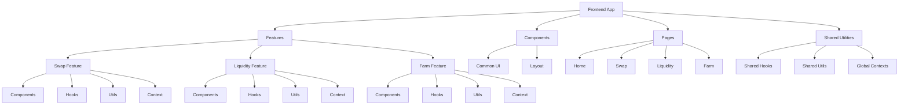

# AIHarvest Frontend

## Overview 概述

The AIHarvest frontend is built with Next.js, React, and Tailwind CSS. It provides a user interface for interacting with the AIHarvest DeFi platform, including token swapping, liquidity provision, and yield farming.

## Current Structure 当前结构

```
frontend/
├── components/           # Shared UI components
│   ├── layout/           # Layout components (Header, Footer)
│   ├── wallet/           # Wallet connection components
│   └── ... other components
├── contexts/             # React contexts for state management
│   └── LiquidityContext.tsx
├── hooks/                # Custom React hooks
│   ├── useWeb3.ts        # Web3 connection hooks
│   ├── useSwap.ts        # Swap functionality hooks
│   ├── useLiquidity.ts   # Liquidity functionality hooks
│   └── ... other hooks
├── pages/                # Next.js pages/routes
│   ├── index.tsx         # Homepage
│   ├── swap.tsx          # Swap page
│   ├── liquidity.tsx     # Liquidity page
│   ├── farm.tsx          # Farming page
│   └── admin/            # Admin pages
├── styles/               # CSS styles
│   ├── globals.css       # Global styles
│   └── ... module CSS files
├── utils/                # Utility functions
│   ├── contracts.ts      # Contract utilities
│   └── ... other utilities
└── constants/            # Constants and configurations
    ├── addresses.ts      # Contract addresses
    └── abis.ts           # Contract ABIs
```

## Proposed Improvements 建议的改进

### Restructure Directory Layout 重构目录布局

```
frontend/
├── components/               # Base/shared components
│   ├── common/               # Common UI components
│   │   ├── Button/           # Button component with its styles
│   │   ├── Card/             # Card component with its styles
│   │   └── ... other common UI components
│   └── layout/               # Layout components
│       ├── Header/           # Header with its styles
│       ├── Footer/           # Footer with its styles
│       └── Layout/           # Main layout wrapper
├── features/                 # Feature-based organization
│   ├── swap/                 # Swap feature
│   │   ├── components/       # Swap-specific components
│   │   ├── hooks/            # Swap-specific hooks
│   │   ├── utils/            # Swap-specific utilities
│   │   └── SwapContext.tsx   # Swap state management
│   ├── liquidity/            # Liquidity feature
│   │   ├── components/       # Liquidity-specific components
│   │   ├── hooks/            # Liquidity-specific hooks
│   │   ├── utils/            # Liquidity-specific utilities
│   │   └── LiquidityContext.tsx # Liquidity state management
│   └── farm/                 # Farming feature
│       ├── components/       # Farm-specific components
│       ├── hooks/            # Farm-specific hooks
│       ├── utils/            # Farm-specific utilities
│       └── FarmContext.tsx   # Farm state management
├── pages/                    # Next.js pages (minimal code)
│   ├── index.tsx             # Homepage
│   ├── swap.tsx              # Imports and uses swap feature
│   ├── liquidity.tsx         # Imports and uses liquidity feature
│   ├── farm.tsx              # Imports and uses farm feature
│   └── admin/                # Admin pages
├── hooks/                    # Shared hooks
│   ├── useWeb3.ts            # Web3 connection hook
│   └── ... other shared hooks
├── utils/                    # Shared utilities
│   ├── contracts.ts          # Contract interaction utilities
│   └── ... other shared utilities
├── contexts/                 # Global contexts
│   └── Web3Context.tsx       # Global web3 context
├── styles/                   # Global styles
│   └── globals.css           # Global CSS
├── constants/                # Application constants
│   ├── addresses.ts          # Contract addresses
│   └── abis.ts               # Contract ABIs
└── types/                    # TypeScript type definitions
    └── index.ts              # Type definitions
```

## Implementation Plan 实施计划

### Phase 1: Initial Restructuring 初始重构

1. Create the new directory structure 创建新的目录结构
2. Move reusable components to the appropriate folders 将可重用组件移至适当的文件夹
3. Create feature folders for swap, liquidity, and farm 为交换、流动性和农场创建功能文件夹

### Phase 2: Refactor Pages 重构页面

1. Break down large page files (swap.tsx, liquidity.tsx, farm.tsx) 分解大型页面文件
2. Move page-specific components to feature folders 将特定于页面的组件移至功能文件夹
3. Keep page files minimal, primarily for routing 保持页面文件最小化，主要用于路由

### Phase 3: Context Improvements 上下文改进

1. Create SwapContext and FarmContext 创建SwapContext和FarmContext
2. Move state management from pages to contexts 将状态管理从页面移至上下文
3. Update hooks to use context values 更新钩子以使用上下文值

### Phase 4: Style Organization 样式组织

1. Co-locate component styles with components 将组件样式与组件放在一起
2. Transition towards a more component-oriented styling approach 过渡到更面向组件的样式方法

## Benefits 优势

1. Better code organization and discoverability 更好的代码组织和可发现性
2. Improved component reusability 提高组件可重用性
3. Clearer separation of concerns 更清晰的关注点分离
4. Easier maintenance and scaling 更容易维护和扩展
5. Better developer experience 更好的开发者体验

