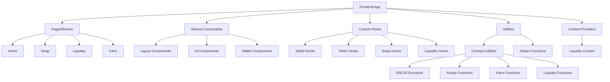

# AIHarvest Frontend

## Overview 概述

The AIHarvest frontend is a decentralized finance (DeFi) application built with Next.js, React, and Tailwind CSS. It provides a user interface for interacting with the AIHarvest DeFi platform, enabling token swapping, liquidity provision, yield farming, and other blockchain operations on the Ethereum network.

AIHarvest前端是一个使用Next.js、React和Tailwind CSS构建的去中心化金融(DeFi)应用程序。它为AIHarvest DeFi平台提供用户界面，支持代币交换、流动性提供、收益耕作以及在以太坊网络上的其他区块链操作。

## Technologies 技术栈

- **Framework**: Next.js (React)
- **Language**: TypeScript
- **Styling**: Tailwind CSS
- **Web3 Integration**: ethers.js, wagmi
- **State Management**: React Context API
- **Development Tools**: ESLint, TypeScript

## Current Structure 当前结构

```
frontend/
├── components/           # Shared UI components 共享UI组件
│   ├── layout/           # Layout components (Header, Footer)
│   ├── wallet/           # Wallet connection components
│   └── ... other components
├── contexts/             # React contexts for state management
│   └── LiquidityContext.tsx
├── hooks/                # Custom React hooks 自定义React钩子
│   ├── useWeb3.ts        # Web3 connection hooks
│   ├── useSwap.ts        # Swap functionality hooks
│   ├── useTokens.ts      # Token operations hooks
│   └── ... other hooks
├── pages/                # Next.js pages/routes
│   ├── index.tsx         # Homepage
│   ├── swap.tsx          # Swap page
│   ├── liquidity.tsx     # Liquidity page
│   ├── farm.tsx          # Farming page
│   └── admin/            # Admin pages
├── styles/               # CSS styles
│   ├── globals.css       # Global styles
│   └── ... module CSS files
├── utils/                # Utility functions
│   ├── contracts/        # Contract utilities
│   │   ├── erc20.ts      # ERC20 token interactions
│   │   ├── router.ts     # Router contract functions
│   │   ├── liquidity.ts  # Liquidity functions
│   │   ├── farm.ts       # Farming contract functions
│   │   └── helpers.ts    # Helper functions
├── constants/            # Constants and configurations
│   ├── addresses.ts      # Contract addresses
│   └── abis.ts           # Contract ABIs
└── scripts/              # Build and utility scripts
```

## Key Features 主要功能

- **Token Swapping**: Exchange between different tokens on the platform
  **代币交换**: 在平台上交换不同的代币

- **Liquidity Provision**: Add and remove liquidity to token pairs
  **流动性提供**: 为代币对添加和移除流动性

- **Yield Farming**: Stake LP tokens to earn rewards
  **收益耕作**: 质押LP代币以赚取奖励

- **Wallet Integration**: Connect to MetaMask and other Web3 wallets
  **钱包集成**: 连接到MetaMask和其他Web3钱包

- **Responsive Design**: Works on desktop and mobile devices
  **响应式设计**: 适用于桌面和移动设备

## Setup and Installation 设置和安装

### Prerequisites 前提条件

- Node.js (v16+)
- npm or yarn
- MetaMask or another Ethereum wallet

### Installation 安装

```bash
# Clone the repository 克隆仓库
git clone https://github.com/yourusername/AIHarvest2.0.git
cd AIHarvest2.0/frontend

# Install dependencies 安装依赖
npm install
# or
yarn install
```

### Environment Configuration 环境配置

Create a `.env.local` file in the frontend directory with the following variables:

在frontend目录中创建一个`.env.local`文件，包含以下变量：

```
NEXT_PUBLIC_CHAIN_ID=11155111  # Sepolia testnet
NEXT_PUBLIC_RPC_URL=https://sepolia.infura.io/v3/your-infura-id
```

## Development 开发

### Running the Development Server 运行开发服务器

```bash
# Start the development server 启动开发服务器
npm run dev
# or
yarn dev
```

The application will be available at `http://localhost:3000`.

应用程序将在`http://localhost:3000`上可用。

### Building for Production 生产环境构建

```bash
# Build the application 构建应用程序
npm run build
# or
yarn build

# Start the production server 启动生产服务器
npm run start
# or
yarn start
```

## Development Guidelines 开发指南

### Code Structure Best Practices 代码结构最佳实践

1. **Component-first approach** - Design components before implementing pages
   **组件优先方法** - 在实现页面之前设计组件

2. **Single responsibility** - Each file should do one thing well
   **单一职责** - 每个文件应该只做好一件事

3. **Feature folders** - Organize new code by feature, not by type
   **功能文件夹** - 按功能而非类型组织新代码

4. **State separation** - Use contexts for shared state, local state for UI
   **状态分离** - 使用上下文管理共享状态，局部状态管理UI

5. **File size limits** - Keep files under 300 lines; extract components and logic when they grow
   **文件大小限制** - 文件保持在300行以内；当它们增长时提取组件和逻辑

### Recommended Structure for New Features 新功能的推荐结构

```
features/                 # Feature-based organization 基于功能的组织
├── swap/                 # Swap feature
│   ├── components/       # Swap-specific components
│   ├── hooks/            # Swap-specific hooks
│   ├── utils/            # Swap-specific utilities
│   └── SwapContext.tsx   # Swap state management
├── liquidity/            # Liquidity feature
│   ├── components/       # Liquidity-specific components
│   ├── hooks/            # Liquidity-specific hooks
│   ├── utils/            # Liquidity-specific utilities
│   └── LiquidityContext.tsx # Liquidity state management
└── farm/                 # Farming feature
    ├── components/       # Farm-specific components
    ├── hooks/            # Farm-specific hooks
    ├── utils/            # Farm-specific utilities
    └── FarmContext.tsx   # Farm state management
```

### Styling Guidelines 样式指南

- Use Tailwind CSS classes for styling
  使用Tailwind CSS类进行样式设计

- For complex components, consider using CSS modules (componentName.module.css)
  对于复杂组件，考虑使用CSS模块 (componentName.module.css)

- Follow the design system colors defined in tailwind.config.js
  遵循tailwind.config.js中定义的设计系统颜色

### Testing 测试

Currently, the project does not have automated tests. This is an area for improvement.

目前，该项目没有自动化测试。这是一个需要改进的领域。

## Architecture 架构



## Contract Integration 合约集成

The frontend interacts with several smart contracts:

前端与多个智能合约交互：

- **Token Contracts**: ERC20 tokens for balance and allowance management
  **代币合约**: 用于余额和授权管理的ERC20代币

- **Router**: For token swaps and path finding
  **路由器**: 用于代币交换和路径查找

- **Factory**: For creating and finding liquidity pairs
  **工厂**: 用于创建和查找流动性对

- **Farm**: For staking and yield farming operations
  **农场**: 用于质押和收益耕作操作

The contract ABIs and addresses are stored in the `constants` directory.

合约ABI和地址存储在`constants`目录中。

## Contributing 贡献

1. Create a feature branch from `develop`
   从`develop`创建功能分支

2. Make your changes following the development guidelines
   按照开发指南进行更改

3. Test your changes locally
   在本地测试您的更改

4. Submit a pull request to the `develop` branch
   向`develop`分支提交拉取请求

## License 许可

This project is licensed under the MIT License.

本项目采用MIT许可证。