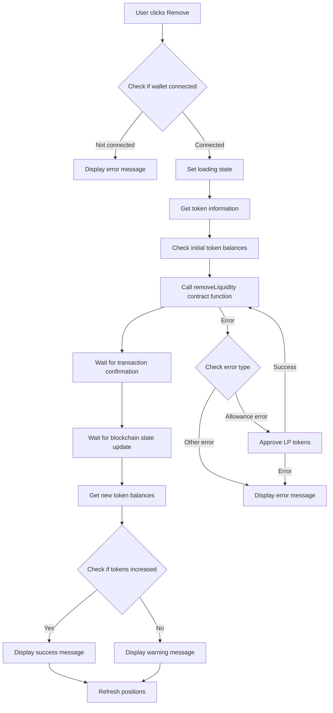

```mermaid
graph TD
    A[User clicks Remove] --> B{Check if wallet connected}
    B -->|Not connected| C[Display error message]
    B -->|Connected| D[Set loading state]
    D --> E[Get token information]
    E --> F[Check initial token balances]
    F --> G[Call removeLiquidity contract function]
    G --> H[Wait for transaction confirmation]
    H --> I[Wait for blockchain state update]
    I --> J[Get new token balances]
    J --> K{Check if tokens increased}
    K -->|Yes| L[Display success message]
    K -->|No| M[Display warning message]
    L --> N[Refresh positions]
    M --> N
    G -->|Error| O{Check error type}
    O -->|Allowance error| P[Approve LP tokens]
    O -->|Other error| Q[Display error message]
    P -->|Success| G
    P -->|Error| Q
``` 