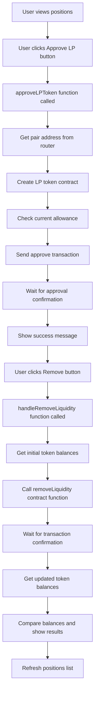

```mermaid
graph TD
    A[User views positions] --> B[User clicks Approve LP button]
    B --> C[approveLPToken function called]
    C --> D[Get pair address from router]
    D --> E[Create LP token contract]
    E --> F[Check current allowance]
    F --> G[Send approve transaction]
    G --> H[Wait for approval confirmation]
    H --> I[Show success message]
    I --> J[User clicks Remove button]
    J --> K[handleRemoveLiquidity function called]
    K --> L[Get initial token balances]
    L --> M[Call removeLiquidity contract function]
    M --> N[Wait for transaction confirmation]
    N --> O[Get updated token balances]
    O --> P[Compare balances and show results]
    P --> Q[Refresh positions list]
``` 