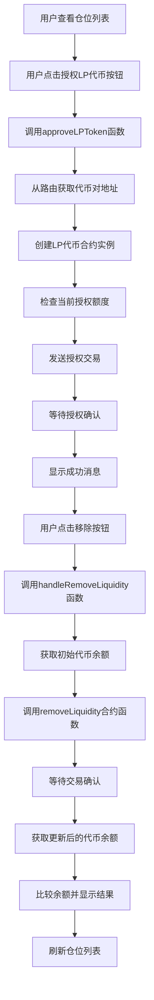

```mermaid
graph TD
    A[用户查看仓位列表] --> B[用户点击授权LP代币按钮]
    B --> C[调用approveLPToken函数]
    C --> D[从路由获取代币对地址]
    D --> E[创建LP代币合约实例]
    E --> F[检查当前授权额度]
    F --> G[发送授权交易]
    G --> H[等待授权确认]
    H --> I[显示成功消息]
    I --> J[用户点击移除按钮]
    J --> K[调用handleRemoveLiquidity函数]
    K --> L[获取初始代币余额]
    L --> M[调用removeLiquidity合约函数]
    M --> N[等待交易确认]
    N --> O[获取更新后的代币余额]
    O --> P[比较余额并显示结果]
    P --> Q[刷新仓位列表]
``` 