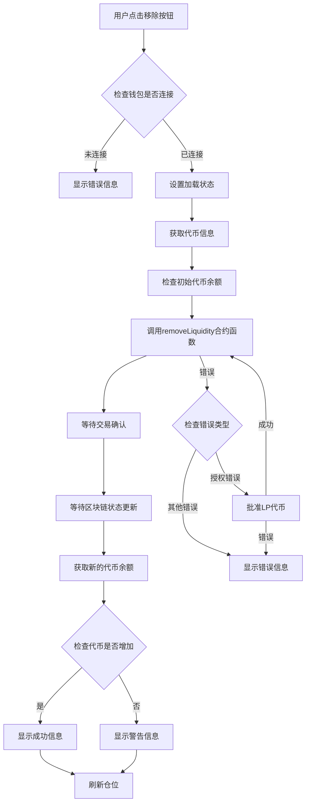

```mermaid
graph TD
    A[用户点击移除按钮] --> B{检查钱包是否连接}
    B -->|未连接| C[显示错误信息]
    B -->|已连接| D[设置加载状态]
    D --> E[获取代币信息]
    E --> F[检查初始代币余额]
    F --> G[调用removeLiquidity合约函数]
    G --> H[等待交易确认]
    H --> I[等待区块链状态更新]
    I --> J[获取新的代币余额]
    J --> K{检查代币是否增加}
    K -->|是| L[显示成功信息]
    K -->|否| M[显示警告信息]
    L --> N[刷新仓位]
    M --> N
    G -->|错误| O{检查错误类型}
    O -->|授权错误| P[批准LP代币]
    O -->|其他错误| Q[显示错误信息]
    P -->|成功| G
    P -->|错误| Q
``` 